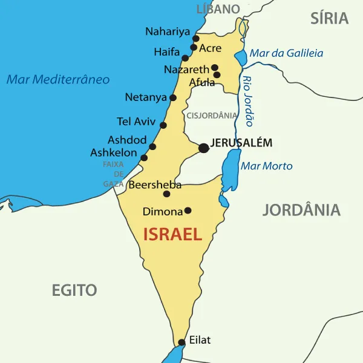
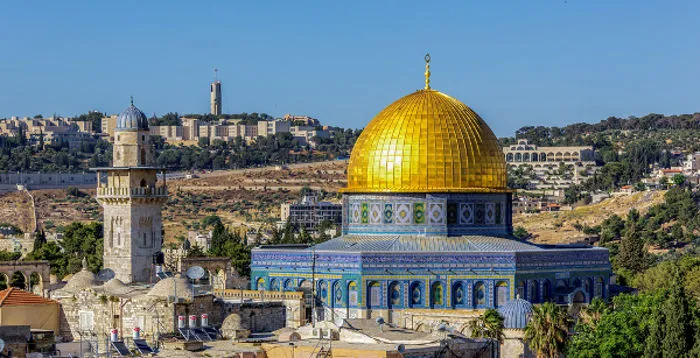
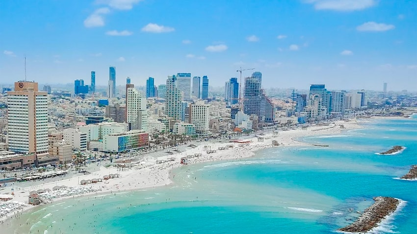
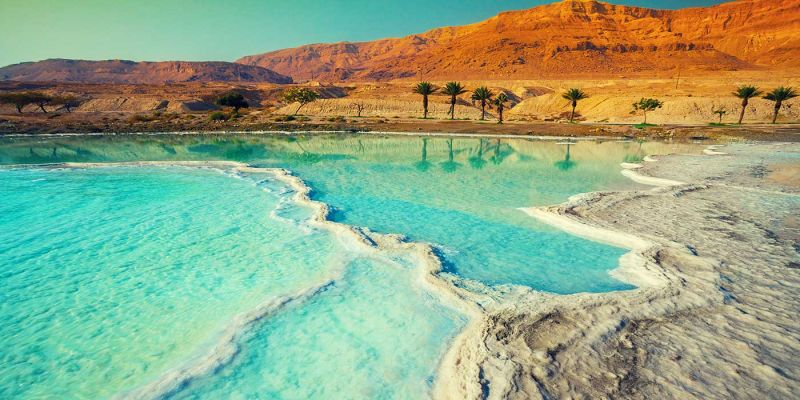
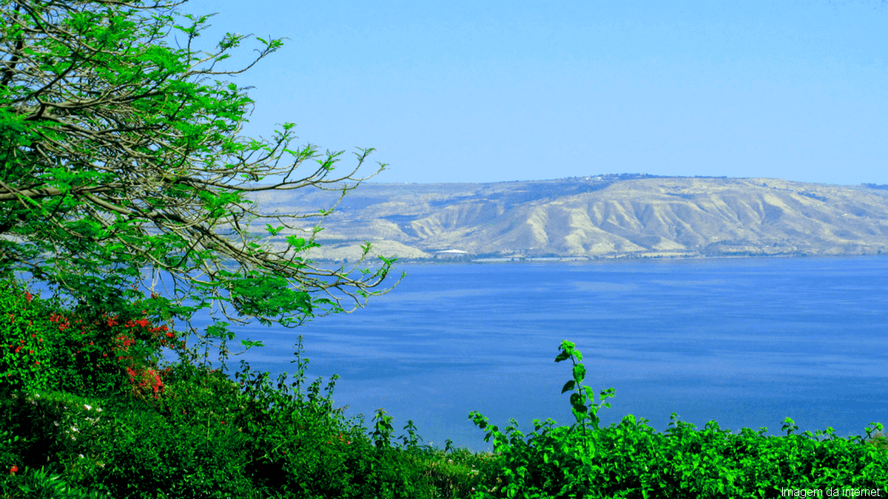
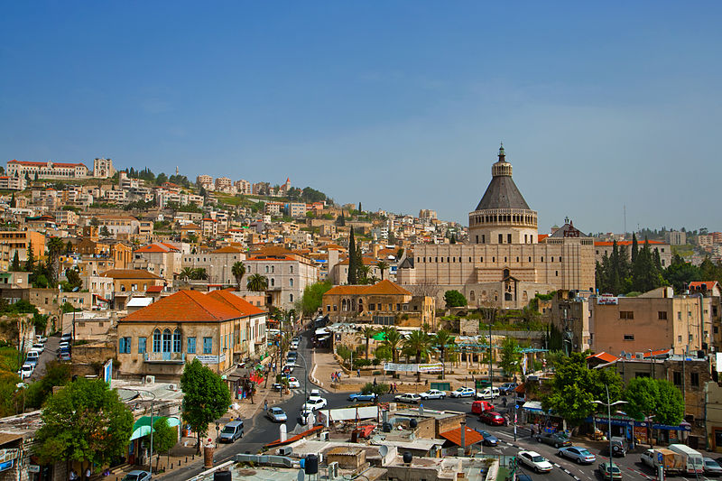

<h1>Israel</h1>

<h2 style="color:#0096FF">Sobre</h2>

Israel é um país localizado no Oriente Médio, na costa leste do Mar Mediterrâneo. Faz fronteira com o Líbano ao norte, Síria ao nordeste, Jordânia ao leste e Egito ao sudoeste. Israel é conhecido por sua significativa importância histórica, cultural e religiosa, pois é o berço do judaísmo, cristianismo e um local-chave na história islâmica.  

* Capital: Jerusalém  
* Continente: Ásia  
* Idioma oficial: Hebraico  
* Presidente: Isaac Herzog  
* Primeiro-ministro: Benjamin Netanyahu  
* Área: 21.937 km²  
* Governo: Parlamentarismo, República parlamentarista  

<h2 style="color:#0096FF">Culturas</h2>

Israel é um país com uma diversidade cultural única, resultado de sua história, localização geográfica e composição étnica. Ele abriga uma mistura de culturas que refletem a diversidade religiosa, étnica e social de sua população.

<h4>1. Cultura Judaica</h4>

A maior parte da população israelense é judaica, e a cultura judaica tem uma forte influência no país. Algumas características da cultura judaica em Israel incluem:

- Religião: O judaísmo é a religião predominante e tem uma grande influência nos costumes diários e nas festividades. As festas judaicas, como o Pessach (Páscoa judaica), o Yom Kipur (Dia da Expiação) e o Shabat (dia de descanso semanal), são amplamente celebradas.

- Cozinha: A culinária israelense é uma mistura de influências do Oriente Médio e do Mediterrâneo. Pratos como falafel, hummus, shawarma e baba ganoush são populares. A comida kosher também é um aspecto importante da cultura judaica em Israel.

- Música e Dança: A música israelense combina estilos tradicionais com influências modernas. A dança folk israelense (como a Hora) é uma parte importante das celebrações e festividades.

<h4>2. Cultura Árabe</h4>

A população árabe de Israel é uma minoria significativa, representando cerca de 20% da população. A cultura árabe em Israel inclui tanto muçulmanos quanto cristãos. As tradições árabes, a língua árabe e a religião muçulmana (principalmente o islamismo sunita) desempenham um papel central para essa comunidade.

- Religião: A maioria dos árabes israelenses é muçulmana, com uma minoria cristã. As festas religiosas muçulmanas, como o Ramadã e o Eid al-Fitr, são amplamente celebradas.

- Cozinha: A comida árabe em Israel é rica e saborosa, com pratos como maqluba (um prato de arroz e carne), kabsa, e doces como baklava e knafeh.

- Música e Dança: A música árabe, com seus ritmos e instrumentos típicos, como o oud e a derbuka, é popular entre os árabes israelenses. O dabke, uma dança folclórica, também é comum em celebrações.

<h4>3. Cultura Druza</h4>

Os drusos são um grupo religioso minoritário em Israel, que segue uma religião distinta, originada do islamismo, mas com crenças próprias. Eles são conhecidos por sua lealdade ao Estado de Israel e têm um papel importante nas Forças de Defesa de Israel (IDF). A cultura druza em Israel é uma fusão de tradições muçulmanas e cristãs, com uma forte ênfase na honra, na hospitalidade e no respeito à autoridade.

<h4>4. Cultura Beduína</h4>

Os beduínos são uma população nômade ou semi-nômade, tradicionalmente vivendo no deserto do Negev, no sul de Israel. A cultura beduína é baseada em tradições antigas de hospitalidade, roupas típicas e uma relação íntima com a natureza e o deserto. A língua beduína é um dialeto árabe, e muitos beduínos ainda vivem de maneira tradicional, embora muitos também tenham se integrado à vida urbana.

<h4>5. Cultura Russa</h4>

A imigração russa para Israel teve um grande impacto na sociedade israelense. Desde o colapso da União Soviética, muitos judeus russos se mudaram para Israel, trazendo consigo sua cultura, culinária e música. A cultura russa em Israel é visível em muitas áreas, incluindo no campo da arte, música e cinema, e a culinária russa também se mistura com a comida israelense.

<h4>6. Cultura Secular e Culturalmente Diversa</h4>

Israel também possui uma grande população secular, que pode ser formada por judeus, árabes, drusos ou outros grupos. Esses indivíduos frequentemente têm uma vida mais conectada à cultura ocidental moderna, com forte presença de arte, teatro, literatura e música contemporânea. Tel Aviv, por exemplo, é conhecida como uma cidade vibrante e moderna, com uma cena artística e cultural ativa, além de ser um centro de inovação tecnológica e start-ups.

<h4>7. Festividades e Celebrações</h4>

- Yom Ha'atzmaut: O Dia da Independência de Israel, comemorado com desfiles, festas e celebrações em todo o país.
- Pessach: A Páscoa judaica, que marca a libertação dos israelitas do Egito, é celebrada com refeições festivas e rituais religiosos.
- Eid al-Fitr e Ramadã: As comemorações muçulmanas também têm grande importância na cultura árabe de Israel.
- Rosh Hashaná: O Ano Novo judaico, com orações e celebrações familiares.

<h4>8. Diversidade Religiosa</h4>

Além do judaísmo e do islamismo, Israel é o lar de muitos outros grupos religiosos, incluindo cristãos, bahá'ís e outras seitas menores. Jerusalém, especialmente, é considerada uma cidade sagrada para várias religiões, e é um centro de peregrinação para judeus, cristãos e muçulmanos.

Essa diversidade cultural e religiosa faz de Israel um lugar de contraste entre o tradicional e o moderno, com várias influências se encontrando e se misturando ao longo da história. A convivência entre culturas distintas é uma parte significativa da vida cotidiana em Israel, embora também haja tensões relacionadas à política e questões de identidade.

<h2 style="color:#0096FF">Pontos Turísticos</h2>

<h4>1. Jerusalém</h4>

Jerusalém é uma das cidades mais sagradas do mundo, com grande importância para judeus, cristãos e muçulmanos. Seus pontos turísticos incluem:

- Muro das Lamentações (Kotel): O local mais sagrado do judaísmo, onde os judeus oram e colocam mensagens de oração nas fendas da parede.
- Igreja do Santo Sepulcro: Um local sagrado para os cristãos, acredita-se que seja o lugar onde Jesus Cristo foi crucificado, sepultado e ressuscitou.
- Cúpula da Rocha: Um dos ícones de Jerusalém e um importante local religioso para os muçulmanos, situado na Esplanada das Mesquitas.
- Via Sacra: O caminho que Jesus percorreu até sua crucificação, que passa por 14 estações e é um local de peregrinação cristã.
- Cidade Velha: Uma área histórica dividida em bairros judaico, cristão, muçulmano e armênio, com mercados, monumentos e locais sagrados.

<h4>2. Tel Aviv</h4>

Tel Aviv é uma cidade moderna, vibrante e cheia de cultura, conhecida por sua vida noturna e praias. Alguns pontos de interesse incluem:

- Praias de Tel Aviv: Famosas por sua beleza e infraestrutura, são ótimas para relaxar e curtir o clima mediterrâneo.
- Jaffa (Yafo): Um bairro histórico de Tel Aviv, com ruas antigas, galerias de arte e o famoso porto de Jaffa.
- Museu de Arte de Tel Aviv: Um dos principais museus de arte de Israel, com uma vasta coleção de obras de artistas internacionais e israelenses.
- Rothschild Boulevard: Conhecida por sua arquitetura Bauhaus e como um centro de vida social e cultural.

<h4>3. Mar Morto</h4>

O Mar Morto é uma das maravilhas naturais mais impressionantes de Israel, famoso por suas águas extremamente salgadas, que permitem que as pessoas flutuem facilmente na superfície. O Mar Morto também é famoso por seus benefícios terapêuticos, devido aos minerais presentes na água e na lama.

- Spa e tratamentos terapêuticos: Muitas resorts ao redor do Mar Morto oferecem banhos de lama e outros tratamentos de bem-estar.
- Qumran: O local onde os Manuscritos do Mar Morto foram descobertos. É uma área arqueológica que remonta a um assentamento da comunidade essênia.

<h4>4. Capernaum e o Lago de Genesaré</h4>

Capernaum é uma antiga cidade bíblica, onde se acredita que Jesus tenha realizado muitos de seus milagres.

- Lago de Genesaré (também conhecido como Lago de Tiberíades) é um local importante para o cristianismo, já que várias passagens do Novo Testamento acontecem nas suas margens.
- Igreja da Multiplicação dos Pães e Peixes: Localizada à beira do Lago de Genesaré, é um importante destino de peregrinação cristã.
- Ruínas de Capernaum: Incluem uma sinagoga antiga e a casa de São Pedro.

<h4>5. Nazareth</h4>

Nazareth é uma cidade de grande importância religiosa, especialmente para os cristãos, já que é o local onde Jesus passou sua infância. Os principais pontos turísticos de Nazareth incluem:

- Basílica da Anunciação: O local onde, segundo a tradição cristã, o anjo Gabriel anunciou à Virgem Maria que ela conceberia Jesus.
- Igreja de São José: Construída sobre o que se acredita ser a antiga casa de São José, o pai terreno de Jesus.

